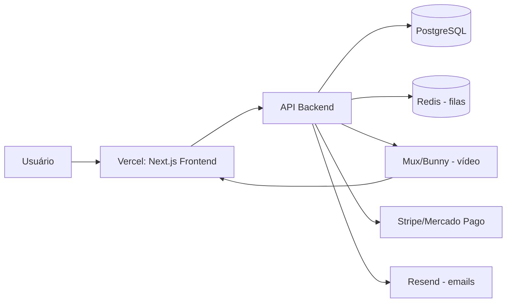

# Arquitetura Completa — Plataforma de Cursos Online (Desenvolvimento Customizado)

## 1. Visão Geral do Sistema

Uma plataforma de cursos online customizada precisa resolver 6 grandes blocos de responsabilidade:

1. **Autenticação e gestão de usuários** (alunos, instrutores, admins)
2. **Catálogo de cursos** (módulos, aulas, materiais)
3. **Pagamentos e acesso** (checkout, assinaturas, liberação de conteúdo)
4. **Streaming de vídeo** (upload, processamento, entrega segura)
5. **Progresso e engajamento** (acompanhamento, certificados, gamificação)
6. **Comunicação** (emails, notificações, comunidade/fórum)

---

## 2. Stack Tecnológica Recomendada

| Camada | Tecnologia | Motivo |
|---|---|---|
| Frontend | Next.js (React) + TypeScript | SSR/SSG para SEO das páginas de venda, boa DX |
| Estilo | Tailwind CSS + shadcn/ui | Rapidez e consistência visual |
| Backend | Node.js (NestJS) ou Next.js API Routes | Escalável, mesma linguagem do front |
| Banco de dados | PostgreSQL | Relacional, robusto para cursos/matrículas/pagamentos |
| ORM | Prisma | Migrations e queries tipadas |
| Cache/Filas | Redis + BullMQ | Filas para processar vídeo, enviar emails, etc. |
| Armazenamento de vídeo | Mux, Bunny Stream ou Cloudflare Stream | Transcodificação + streaming adaptativo (HLS) |
| Armazenamento de arquivos | Cloudflare R2 ou AWS S3 | PDFs, materiais complementares, imagens |
| Pagamentos | Stripe (internacional) + Mercado Pago/Pagar.me (Brasil, Pix/boleto) | Cobrir cartão, Pix, boleto |
| Autenticação | NextAuth.js / Auth.js ou Clerk | OAuth + email/senha prontos |
| Emails transacionais | Resend ou SendGrid | Boas-vindas, recuperação de senha, avisos |
| Hospedagem | Vercel (frontend) + Railway/Render/AWS (backend e banco) | Deploy simples, escala sob demanda |
| Monitoramento | Sentry + PostHog/Plausible | Erros e analytics de uso |

> Alternativa mais simples: Next.js full-stack (App Router com Server Actions) rodando tudo em um único projeto, banco Postgres gerenciado (Supabase ou Neon) — reduz a complexidade de infra para times pequenos.

---

## 3. Estrutura de Pastas (Monorepo)

```
plataforma-cursos/
├── apps/
│   ├── web/                    # Next.js — site público + área do aluno
│   │   ├── app/
│   │   │   ├── (marketing)/    # Landing pages, páginas de venda
│   │   │   ├── (auth)/         # Login, cadastro, recuperação de senha
│   │   │   ├── (dashboard)/    # Área logada do aluno
│   │   │   │   ├── meus-cursos/
│   │   │   │   ├── curso/[slug]/
│   │   │   │   ├── certificados/
│   │   │   │   └── perfil/
│   │   │   └── (checkout)/     # Fluxo de compra
│   │   ├── components/
│   │   └── lib/
│   ├── admin/                  # Painel do instrutor/admin (Next.js separado ou rota protegida)
│   │   ├── cursos/             # CRUD de cursos, módulos, aulas
│   │   ├── alunos/             # Gestão de matrículas
│   │   ├── financeiro/         # Relatórios de venda
│   │   └── configuracoes/
│   └── api/                    # Backend (se separado do Next.js)
│       ├── src/
│       │   ├── modules/
│       │   │   ├── auth/
│       │   │   ├── courses/
│       │   │   ├── enrollments/
│       │   │   ├── payments/
│       │   │   ├── video/
│       │   │   └── certificates/
│       │   └── main.ts
├── packages/
│   ├── database/                # Schema Prisma compartilhado
│   ├── ui/                      # Componentes compartilhados
│   └── config/                  # ESLint, TS config compartilhados
└── infra/
    └── docker-compose.yml       # Ambiente local (Postgres, Redis)
```

---

## 4. Modelagem do Banco de Dados (entidades principais)

```
User
 ├─ id, name, email, password_hash, role (student/instructor/admin), created_at

Course
 ├─ id, title, slug, description, price, status (draft/published), instructor_id

Module
 ├─ id, course_id, title, order

Lesson
 ├─ id, module_id, title, video_url, duration, type (video/text/quiz), order, is_free_preview

Enrollment
 ├─ id, user_id, course_id, status (active/expired), enrolled_at

LessonProgress
 ├─ id, user_id, lesson_id, completed, watched_seconds, completed_at

Payment
 ├─ id, user_id, course_id, amount, method (card/pix/boleto), status, gateway_id

Certificate
 ├─ id, user_id, course_id, issued_at, certificate_url

Coupon
 ├─ id, code, discount_percent, valid_until, max_uses
```

Relações-chave: `User 1—N Enrollment N—1 Course`, `Course 1—N Module 1—N Lesson`, `User 1—N LessonProgress N—1 Lesson`.

---

## 5. Fluxos Críticos

### 5.1 Compra e liberação de acesso
1. Aluno escolhe curso → checkout (Stripe/Mercado Pago)
2. Gateway confirma pagamento via **webhook** (nunca libere acesso só pelo retorno do front — espere a confirmação do servidor)
3. Backend cria `Enrollment` e dispara email de boas-vindas
4. Aluno é redirecionado para a área de membros

### 5.2 Upload e entrega de vídeo
1. Instrutor faz upload do vídeo bruto → vai para um bucket temporário
2. Serviço de vídeo (Mux/Bunny) processa e gera múltiplas resoluções (HLS)
3. Backend salva o `playback_id`, não a URL direta do arquivo
4. No player, gera-se uma **URL assinada com expiração curta** para evitar vídeos "vazando" por link direto
5. Player no front (ex: `hls.js` ou o player nativo do provedor) consome esse HLS

### 5.3 Progresso do aluno
- Front envia eventos periódicos (ex: a cada 15s de vídeo assistido) para atualizar `LessonProgress`
- Aula é marcada como concluída ao atingir ~90% do vídeo
- Progresso do curso = % de aulas concluídas → dispara emissão de certificado quando 100%

### 5.4 Emissão de certificado
- Gerar PDF (ex: com `puppeteer` ou template + `pdf-lib`) com nome do aluno, curso e data
- Salvar no storage e gerar link público com hash único para validação

---

## 6. Segurança e Proteção de Conteúdo

- **Nunca** hospede vídeos como arquivo estático público — use streaming com token assinado
- Rate limiting nas rotas de API (ex: `@nestjs/throttler` ou Upstash Ratelimit)
- Sanitização de inputs e proteção contra SQL Injection (o Prisma já ajuda nisso)
- 2FA opcional para admins/instrutores
- Webhooks de pagamento devem validar assinatura (evitar liberar curso com requisição falsa)
- LGPD: política de privacidade, consentimento de dados, opção de exclusão de conta

---

## 7. Infraestrutura e Deploy



- **Ambiente de staging** separado de produção antes de qualquer deploy
- CI/CD via GitHub Actions: lint → testes → build → deploy automático
- Backups automáticos diários do banco de dados

---

## 8. Roadmap Sugerido de Desenvolvimento

**Fase 1 — MVP (6-10 semanas)**
- Autenticação, catálogo de cursos, player de vídeo básico, checkout com 1 gateway, área do aluno simples

**Fase 2 — Consolidação (4-6 semanas)**
- Certificados, progresso detalhado, cupons de desconto, painel administrativo completo

**Fase 3 — Crescimento**
- Comunidade/fórum, gamificação (badges, ranking), app mobile (React Native reaproveitando lógica), afiliados

---

## 9. Estimativa de Complexidade

| Módulo | Complexidade | Observação |
|---|---|---|
| Auth + catálogo | Baixa-Média | Bem padronizado, muitas libs prontas |
| Pagamentos (Pix/boleto/cartão) | Média-Alta | Webhooks e edge cases exigem atenção |
| Streaming de vídeo seguro | Alta | Melhor terceirizar (Mux/Bunny) do que construir do zero |
| Certificados | Baixa | Geração de PDF é simples |
| Painel admin completo | Média | CRUD extenso, mas repetitivo |

---

### Observação final
Construir do zero faz sentido quando você tem uma necessidade muito específica que nenhuma plataforma pronta atende, ou está criando um produto de edtech para escalar como negócio. Para a maioria dos criadores de curso, vale considerar terceirizar as partes de "commodity" (vídeo, pagamento) via serviços especializados mesmo dentro de uma stack customizada — isso já está refletido nesta arquitetura.
