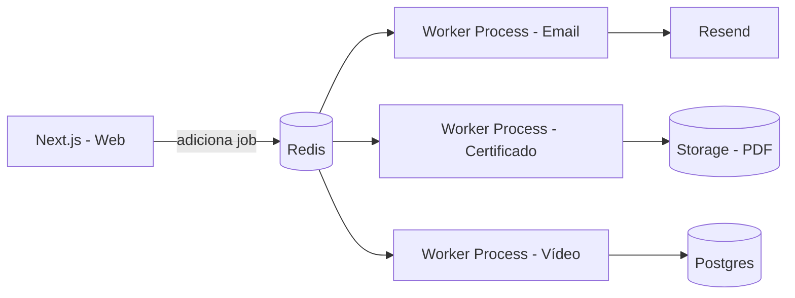

# Fila Assíncrona com BullMQ — Vídeo, Certificados e Emails

## 1. Por que uma fila é necessária aqui

Três operações da plataforma são lentas ou não podem travar a resposta ao usuário:
- **Processar vídeo** (minutos, feito pelo Mux/Bunny, mas você processa o webhook de retorno)
- **Gerar certificado em PDF** (Puppeteer demora ~1-3s, não deve travar a requisição que marca a aula como concluída)
- **Enviar email** (depende de serviço externo, pode falhar temporariamente)

Sem fila, essas operações rodam de forma síncrona dentro da requisição HTTP — se o serviço de email cair por 2 segundos, o aluno fica esperando a tela travar. Com fila, a requisição responde imediato e o trabalho pesado acontece em background, com **retry automático** se algo falhar.

---

## 2. Setup Base

```bash
npm install bullmq ioredis
```

```typescript
// lib/queue/connection.ts
import { Redis } from "ioredis";

export const connection = new Redis(process.env.REDIS_URL!, {
  maxRetriesPerRequest: null, // exigido pelo BullMQ
});
```

### 2.1 Definindo as filas

```typescript
// lib/queue/queues.ts
import { Queue } from "bullmq";
import { connection } from "./connection";

export const emailQueue = new Queue("email", { connection });
export const certificateQueue = new Queue("certificate", { connection });
export const videoQueue = new Queue("video-processing", { connection });
```

> Separar por fila (em vez de uma fila genérica "jobs") permite dar **prioridades e configs diferentes** para cada tipo — ex: emails podem ter mais tentativas, certificados podem rodar com menos concorrência por serem pesados em CPU (Puppeteer).

---

## 3. Fila de E-mails

### 3.1 Produtor (dispara o job)

```typescript
// lib/queue/producers/email.ts
import { emailQueue } from "../queues";

export async function queueWelcomeEmail(userId: string, courseId: string) {
  await emailQueue.add(
    "welcome-email",
    { userId, courseId },
    {
      attempts: 5,
      backoff: { type: "exponential", delay: 5000 }, // 5s, 10s, 20s, 40s, 80s
      removeOnComplete: true,
      removeOnFail: false, // mantém falhas pra você investigar depois
    }
  );
}
```

Isso substitui o comentário `// Disparar aqui: email de boas-vindas` dos webhooks de pagamento que vimos antes:

```typescript
// dentro do webhook do Stripe/Mercado Pago, depois de criar o Enrollment
await queueWelcomeEmail(userId, courseId);
```

### 3.2 Worker (processa o job)

```typescript
// workers/email.worker.ts
import { Worker } from "bullmq";
import { connection } from "@/lib/queue/connection";
import { resend } from "@/lib/resend";
import { prisma } from "@/lib/prisma";

export const emailWorker = new Worker(
  "email",
  async (job) => {
    if (job.name === "welcome-email") {
      const { userId, courseId } = job.data;
      const user = await prisma.user.findUniqueOrThrow({ where: { id: userId } });
      const course = await prisma.course.findUniqueOrThrow({ where: { id: courseId } });

      await resend.emails.send({
        from: "cursos@seusite.com",
        to: user.email,
        subject: `Bem-vindo(a) ao curso ${course.title}!`,
        html: `<p>Olá ${user.name}, seu acesso já está liberado...</p>`,
      });
    }

    if (job.name === "payment-failed-email") {
      const { userId } = job.data;
      const user = await prisma.user.findUniqueOrThrow({ where: { id: userId } });
      await resend.emails.send({
        from: "cursos@seusite.com",
        to: user.email,
        subject: "Houve um problema com seu pagamento",
        html: `<p>Não conseguimos processar a renovação da sua assinatura...</p>`,
      });
    }
  },
  { connection, concurrency: 10 } // processa até 10 emails em paralelo
);

emailWorker.on("failed", (job, err) => {
  console.error(`Email job ${job?.id} falhou:`, err.message);
  // Aqui entra integração com Sentry para alertar sobre falhas persistentes
});
```

---

## 4. Fila de Certificados

### 4.1 Produtor

Substitui a chamada direta a `issueCertificateIfEligible` que vimos antes — agora ela só **enfileira**, não executa na hora:

```typescript
// lib/queue/producers/certificate.ts
import { certificateQueue } from "../queues";

export async function queueCertificateCheck(userId: string, courseId: string) {
  await certificateQueue.add(
    "check-and-issue",
    { userId, courseId },
    {
      attempts: 3,
      backoff: { type: "exponential", delay: 3000 },
      // Evita duplicar o job se o aluno assistir a última aula duas vezes rápido
      jobId: `cert-${userId}-${courseId}`,
    }
  );
}
```

O `jobId` fixo é o pulo do gato aqui: se o mesmo job (mesmo `userId` + `courseId`) já estiver na fila ou tiver sido processado, o BullMQ **não cria duplicata** — resolve o problema de o aluno clicar duas vezes ou o evento de progresso disparar mais de uma vez.

### 4.2 Onde isso é chamado

```typescript
// app/api/lessons/[id]/progress/route.ts
export async function POST(req: Request, { params }: { params: { id: string } }) {
  const user = await getCurrentUser(req);
  const { watchedSeconds } = await req.json();

  const lesson = await prisma.lesson.findUniqueOrThrow({
    where: { id: params.id },
    include: { module: true },
  });

  const completed = lesson.durationSecs ? watchedSeconds / lesson.durationSecs >= 0.9 : false;

  await prisma.lessonProgress.upsert({
    where: { userId_lessonId: { userId: user.id, lessonId: lesson.id } },
    create: { userId: user.id, lessonId: lesson.id, watchedSeconds, completed },
    update: { watchedSeconds, completed, completedAt: completed ? new Date() : undefined },
  });

  if (completed) {
    // Não bloqueia a resposta — só enfileira e responde na hora
    await queueCertificateCheck(user.id, lesson.module.courseId);
  }

  return Response.json({ ok: true });
}
```

### 4.3 Worker

```typescript
// workers/certificate.worker.ts
import { Worker } from "bullmq";
import { connection } from "@/lib/queue/connection";
import { issueCertificateIfEligible } from "@/lib/certificates";
import { queueWelcomeEmail } from "@/lib/queue/producers/email";

export const certificateWorker = new Worker(
  "certificate",
  async (job) => {
    const { userId, courseId } = job.data;
    const certificate = await issueCertificateIfEligible(userId, courseId);

    if (certificate) {
      await emailQueue.add("certificate-issued-email", { userId, courseId });
    }
    // Se retornar null, é porque o aluno ainda não concluiu todas as aulas —
    // não é um erro, então o job simplesmente termina sem gerar nada
  },
  { connection, concurrency: 3 } // baixa concorrência: Puppeteer consome bastante CPU/memória
);
```

---

## 5. Fila de Processamento de Vídeo

Aqui a fila serve mais para **reagir ao webhook do Mux/Bunny** de forma resiliente do que para processar o vídeo em si (isso quem faz é o provedor externo).

```typescript
// app/api/webhooks/mux/route.ts
import { videoQueue } from "@/lib/queue/queues";

export async function POST(req: Request) {
  const event = await req.json();

  // Responde rápido pro Mux (eles têm timeout curto) e processa depois
  await videoQueue.add("mux-event", event, { attempts: 5 });

  return new Response("ok", { status: 200 });
}
```

```typescript
// workers/video.worker.ts
import { Worker } from "bullmq";
import { connection } from "@/lib/queue/connection";
import { prisma } from "@/lib/prisma";

export const videoWorker = new Worker(
  "video-processing",
  async (job) => {
    const event = job.data;

    if (event.type === "video.asset.ready") {
      const playbackId = event.data.playback_ids[0].id;
      await prisma.lesson.updateMany({
        where: { videoAssetId: event.data.upload_id },
        data: { videoAssetId: playbackId },
      });
    }

    if (event.type === "video.asset.errored") {
      // Aqui você notificaria o instrutor que o upload falhou
      console.error("Falha no processamento de vídeo:", event.data.id);
    }
  },
  { connection, concurrency: 5 }
);
```

---

## 6. Rodando os Workers (infraestrutura)

Os workers **não rodam dentro do processo do Next.js** — precisam de um processo Node separado e persistente (Next.js serverless não mantém processo vivo entre requisições).

```typescript
// workers/index.ts — ponto de entrada único
import "./email.worker";
import "./certificate.worker";
import "./video.worker";

console.log("Workers rodando...");
```

```json
// package.json
{
  "scripts": {
    "dev:web": "next dev",
    "dev:workers": "tsx watch workers/index.ts",
    "start:workers": "tsx workers/index.ts"
  }
}
```

**Onde hospedar:** Railway, Render ou um serviço separado no AWS/Fly.io rodando `npm run start:workers` como processo de background (não como servidor web). O Redis também precisa estar acessível por esse processo — normalmente Upstash Redis (serverless) ou Redis gerenciado do próprio Railway/Render.



---

## 7. Monitoramento das Filas (Bull Board)

Fila sem visibilidade é fila que você só descobre que quebrou quando o aluno reclama. O **Bull Board** dá um painel visual de jobs pendentes, falhos e completos.

```bash
npm install @bull-board/api @bull-board/express express
```

```typescript
// workers/dashboard.ts
import express from "express";
import { createBullBoard } from "@bull-board/api";
import { BullMQAdapter } from "@bull-board/api/bullMQAdapter";
import { ExpressAdapter } from "@bull-board/express";
import { emailQueue, certificateQueue, videoQueue } from "@/lib/queue/queues";

const app = express();
const serverAdapter = new ExpressAdapter();
serverAdapter.setBasePath("/admin/queues");

createBullBoard({
  queues: [
    new BullMQAdapter(emailQueue),
    new BullMQAdapter(certificateQueue),
    new BullMQAdapter(videoQueue),
  ],
  serverAdapter,
});

app.use("/admin/queues", serverAdapter.getRouter());
app.listen(3001, () => console.log("Bull Board em http://localhost:3001/admin/queues"));
```

> **Importante:** proteja essa rota com autenticação (basic auth ou checagem de sessão de admin) antes de expor em produção — ela mostra dados sensíveis de jobs (emails, IDs de usuários).

---

## 8. Tratando Falhas Definitivas (Dead Letter)

Quando um job esgota todas as tentativas (`attempts`) e continua falhando, ele fica marcado como `failed` — mas não desaparece. Vale ter um processo para lidar com isso:

```typescript
// workers/email.worker.ts (adicionando)
emailWorker.on("failed", async (job, err) => {
  if (job && job.attemptsMade >= (job.opts.attempts ?? 1)) {
    // Esgotou todas as tentativas — registra para investigação manual
    await prisma.failedJob.create({
      data: {
        queueName: "email",
        jobName: job.name,
        payload: JSON.stringify(job.data),
        error: err.message,
      },
    });
  }
});
```

```prisma
model FailedJob {
  id        String   @id @default(cuid())
  queueName String   @map("queue_name")
  jobName   String   @map("job_name")
  payload   String
  error     String
  createdAt DateTime @default(now()) @map("created_at")
  resolved  Boolean  @default(false)

  @@map("failed_jobs")
}
```

Isso vira uma tela simples no painel admin: "Jobs que falharam definitivamente", onde alguém do time pode reprocessar manualmente ou investigar a causa raiz (ex: email do aluno inválido).

---

## 9. Resumo de Configuração por Fila

| Fila | Concorrência | Tentativas | Motivo |
|---|---|---|---|
| `email` | 10 | 5 | Leve, mas depende de serviço externo que pode oscilar |
| `certificate` | 3 | 3 | Puppeteer é pesado em CPU/memória — não pode escalar concorrência livremente |
| `video-processing` | 5 | 5 | Só processa webhooks (rápido), mas precisa ser resiliente a picos de eventos |

---

## 10. Checklist Final desta Parte

- [ ] Workers rodam em processo separado do servidor web, nunca dentro de rotas serverless
- [ ] `jobId` fixo em jobs que não podem duplicar (ex: certificado por aluno+curso)
- [ ] `attempts` + `backoff` exponencial configurado em toda fila que depende de serviço externo
- [ ] Bull Board protegido por autenticação, nunca público
- [ ] Falhas definitivas registradas em tabela própria para investigação manual
- [ ] Redis com persistência habilitada (não use Redis só de cache para isso — jobs precisam sobreviver a um restart)
